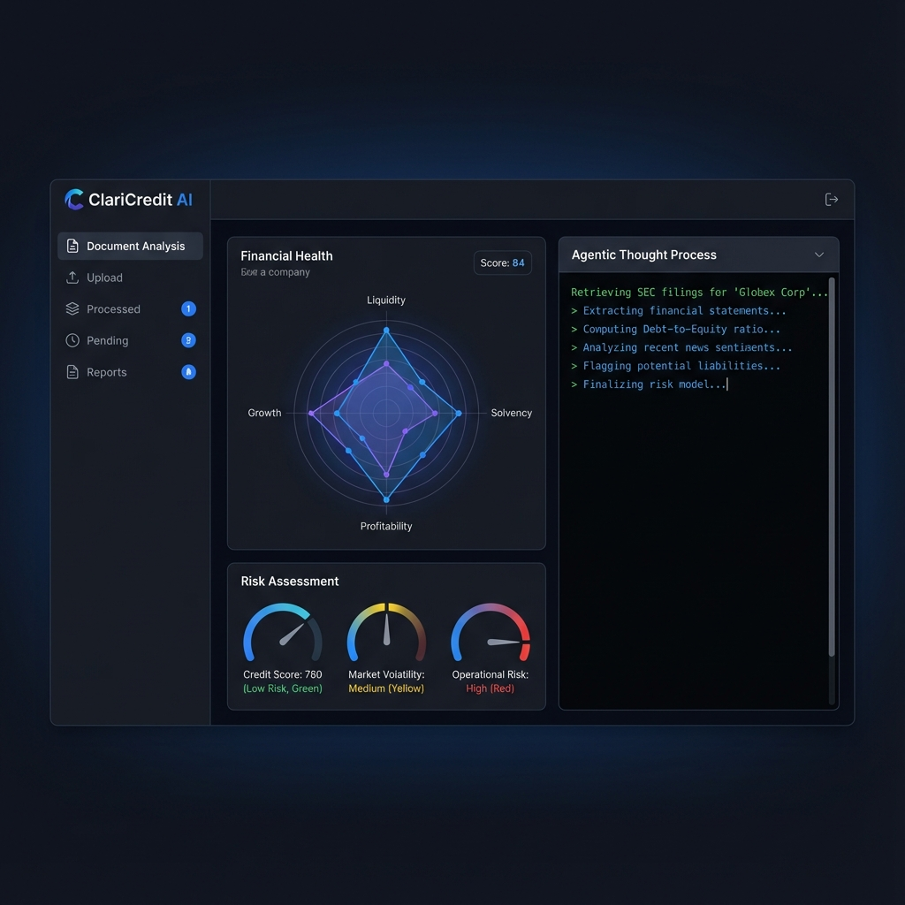
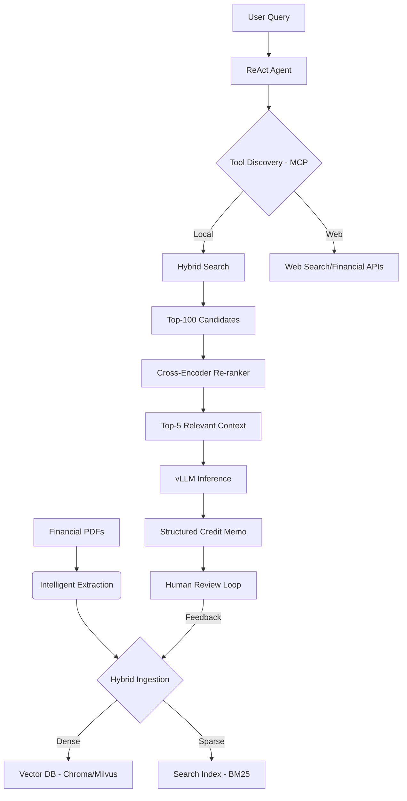

# ClariCredit AI 📄🚀
### Enterprise-Grade Agentic RAG for Automated Credit Analysis

[](https://opensource.org/licenses/MIT)
[](https://www.python.org/downloads/)
[](https://fastapi.tiangolo.com/)
[](https://github.com/vllm-project/vllm)

**ClariCredit AI** is an advanced Agentic RAG (Retrieval-Augmented Generation) pipeline specifically engineered to automate the complex lifecycle of credit memo generation. By leveraging a ReAct-based agentic architecture, hybrid retrieval, and the Model Context Protocol (MCP), it transforms weeks of manual financial analysis into a streamlined 3-day process.

---



---

## 🌟 Real-World Impact
*   **85% Reduction** in Credit Memo generation cycle (3 weeks → 3 days).
*   **Hallucination Rate dropped to <4%** via HITL (Human-in-the-Loop) feedback loops.
*   **22% Latency Improvement** on P99 requests using vLLM PagedAttention.
*   **Scalable to Millions** of documents using sharded vector databases.

---

## 🏗️ Technical Architecture

ClariCredit AI uses a multi-layered architecture designed for precision and production scale:

### 1. The Reasoning Brain (ReAct Agent)
Powered by **Llama-3.1-8B** (fine-tuned) or **GPT-4o**, the agent uses a **Reasoning + Acting (ReAct)** loop. It doesn't just retrieve; it decides *how* to retrieve, whether to search the web for industry benchmarks, or query internal financial databases.

### 2. Hybrid Retrieval Engine (Dense + Sparse)
Combines the best of two worlds to handle both semantic concepts and exact figures:
*   **Dense Retrieval**: Deep semantic understanding via **BGE-Base-v1.5** embeddings.
*   **Sparse Retrieval**: Exact keyword matching via **BM25** to catch specific financial amounts and entity names.
*   **RRF Fusion**: Results are merged using Reciprocal Rank Fusion, ensuring that "hidden" relevant documents rank higher.

### 3. Precision Re-ranking (Cross-Encoder)
Top-K candidates (usually 100) are passed through a **Cross-Encoder Re-ranker**. This stage eliminates noise by analyzing the query and document *together*, ensuring the LLM receives only the most contextually relevant chunks.

### 4. MCP Integration (Model Context Protocol)
Standardizes the interface between the Agent and external tools (Salesforce, Bloomberg, Internal DBs). This decouples orchestration logic from data silos, allowing for plug-and-play tool integration and a 60% reduction in custom integration boilerplate.

---

## 🎥 System Workflow



---

## 🔬 Engineering Deep-Dive

### ⚡ Performance Optimization
*   **PagedAttention**: By implementing vLLM, we eliminate memory fragmentation in the KV cache, allowing for high-throughput concurrent generation without Out-Of-Memory (OOM) errors.
*   **Dynamic Batching**: Requests are batched on-the-fly to maximize GPU utilization (TFLOPS) while maintaining sub-second Time-To-First-Token (TTFT).
*   **Asynchronous Orchestration**: The ingestion pipeline (Kafka → Spark) and retrieval pipeline are fully asynchronous, ensuring the UI remains responsive even during heavy processing.

### 🛡️ Trust & Alignment
*   **Human-in-the-Loop (HITL)**: Every corrected memo becomes a "Golden Example" for the next iteration, creating a self-improving data flywheel.
*   **Confidence Routing**: Low-confidence retrievals are automatically flagged for manual review before generation.

---

## 🛠️ Tech Stack
*   **Core**: Python 3.10+, FastAPI, Pydantic
*   **LLM Orchestration**: ReAct Framework, LangGraph/LangChain
*   **Inference**: vLLM, NVIDIA Triton (Ready)
*   **Vector DB**: ChromaDB, Milvus
*   **Embeddings**: BGE-Base-v1.5 / Nomic-768
*   **Tools**: Model Context Protocol (MCP), Tavily, Yahoo Finance

---

## 📋 Getting Started

### Prerequisites
- Python 3.10+
- CUDA-compatible GPU (Optional, for vLLM acceleration)

### Installation
```bash
git clone https://github.com/shauryanegi/claricredit-ai.git
cd claricredit-ai
python -m venv venv
source venv/bin/activate
pip install -r requirements.txt
```

---

## 🗺️ Roadmap
- [ ] **Multi-Modal Support**: Analyzing charts and tables via Vision-LLMs (Llava/GPT-4o-V).
- [ ] **Bloomberg Terminal Integration**: Real-time financial data feeds via MCP.
- [ ] **DPO Alignment**: Fine-tuning the core model using Direct Preference Optimization on expert-corrected memos.
- [ ] **Distributed Deployment**: Kubernetes (K8s) manifests for scalable GPU serving.

---

## 📊 Evaluation
We use the **RAGAS** framework for automated evaluation:
*   **Faithfulness**: Answer grounding in retrieved context.
*   **Answer Relevancy**: Query-response alignment.
*   **Context Precision**: Signal-to-noise ratio in retrieval.

---
**Built with ❤️ for the future of Financial Intelligence.**
