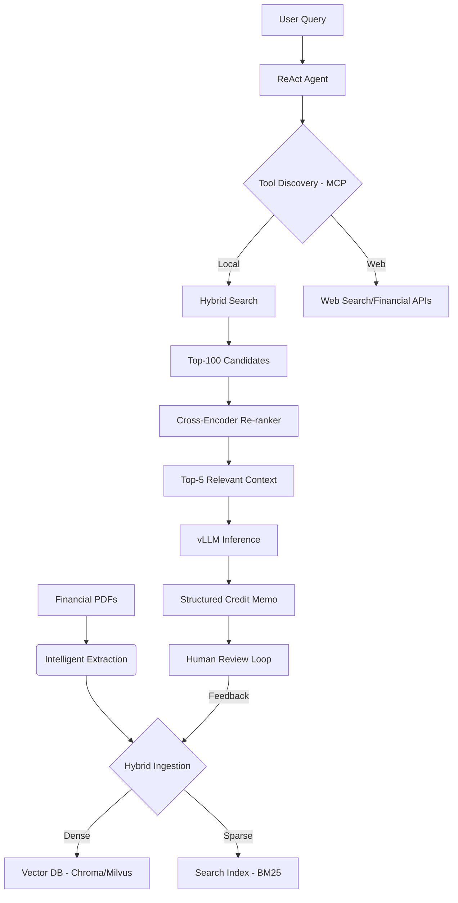

# ClariCredit AI 📄🚀
### Enterprise-Grade Agentic RAG for Automated Credit Analysis

[](https://opensource.org/licenses/MIT)
[](https://www.python.org/downloads/)
[](https://fastapi.tiangolo.com/)
[](https://github.com/vllm-project/vllm)

**ClariCredit AI** is an advanced Agentic RAG (Retrieval-Augmented Generation) pipeline specifically engineered to automate the complex lifecycle of credit memo generation. By leveraging a ReAct-based agentic architecture, hybrid retrieval, and the Model Context Protocol (MCP), it transforms weeks of manual financial analysis into a streamlined 3-day process.

---

## 🌟 Real-World Impact
*   **85% Reduction** in Credit Memo generation cycle (3 weeks → 3 days).
*   **Hallucination Rate dropped to <4%** via HITL (Human-in-the-Loop) feedback loops.
*   **22% Latency Improvement** on P99 requests using vLLM PagedAttention.
*   **Scalable to Millions** of documents using sharded vector databases.

---

## 🏗️ Technical Architecture

ClariCredit AI uses a multi-layered architecture designed for precision and production scale:

### 1. The Reasoning Brain (ReAct Agent)
Powered by **Llama-3.1-8B** (fine-tuned) or **GPT-4o**, the agent uses a **Reasoning + Acting (ReAct)** loop. It doesn't just retrieve; it decides *how* to retrieve, whether to search the web for industry benchmarks, or query internal financial databases.

### 2. Hybrid Retrieval Engine
Combines the best of two worlds:
*   **Dense Retrieval**: Deep semantic understanding via **BGE-Base-v1.5** embeddings stored in **Chroma/Milvus**.
*   **Sparse Retrieval**: Exact keyword matching via **BM25** to catch specific financial entities and amounts.
*   **RRF Fusion**: Results are merged using Reciprocal Rank Fusion for optimal coverage.

### 3. Precision Re-ranking
Top-K candidates are passed through a **Cross-Encoder Re-ranker**. This stage eliminates noise and ensures the LLM receives only the most contextually relevant chunks, significantly reducing hallucinations.

### 4. MCP Integration (Model Context Protocol)
Standardizes the interface between the Agent and external tools (Salesforce, Bloomberg, Internal DBs), decoupling orchestration logic from data silos and reducing boilerplate by 60%.

---

## 🎥 System Workflow



---

## 🛠️ Tech Stack
*   **Core**: Python 3.10+, FastAPI
*   **LLM Orchestration**: ReAct Framework, LangGraph/LangChain
*   **Inference**: vLLM (supporting PagedAttention & Dynamic Batching)
*   **Vector DB**: ChromaDB (Default), Milvus (for scale)
*   **Embeddings**: BGE-Base-v1.5 / Nomic-768
*   **Tools**: MCP (Model Context Protocol), Tavily, Yahoo Finance

---

## 📋 Getting Started

### Prerequisites
- Python 3.10 or 3.11
- CUDA-compatible GPU (Optional, for local vLLM acceleration)

### Installation
```bash
# Clone the repository
git clone https://github.com/yourusername/claricredit-ai.git
cd claricredit-ai

# Set up virtual environment
python -m venv venv
source venv/activate

# Install core dependencies
pip install -r requirements.txt
```

### Configuration
Create a `.env` file in the root directory:
```env
OPENAI_API_KEY=your_key_here
TAVILY_API_KEY=your_key_here
DATABASE_URL=your_db_url
VECTOR_DB_PATH=./chroma_db
```

### Running the API
```bash
uvicorn app:app --host 0.0.0.0 --port 9999 --reload
```

---

## 📊 Evaluation & Metrics
We use the **RAGAS** framework to measure performance across four critical dimensions:
*   **Faithfulness**: Ensuring answers are grounded ONLY in provided documents.
*   **Answer Relevancy**: Does the memo actually address the target risk profile?
*   **Context Precision**: How much "signal" is in our Top-K retrieved chunks?
*   **BERTScore / ROUGE-L**: Comparing generated memos against "Golden Summaries" from senior analysts.

---

## 🤝 Contributing
Contributions are welcome! Please read the [CONTRIBUTING.md](CONTRIBUTING.md) for details on our code of conduct and the process for submitting pull requests.

## 📄 License
This project is licensed under the MIT License - see the [LICENSE](LICENSE) file for details.

---
**Built with ❤️ for the future of Financial Intelligence.**
